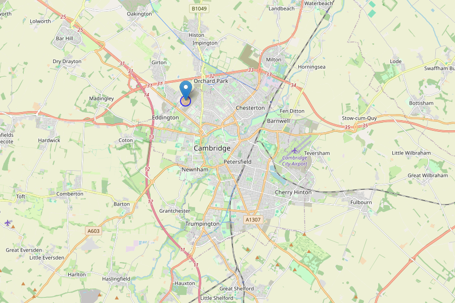



Championing local community, in Cambridge
{.display-6}



{}
Darwin Green is a growing neighbourhood in the north-west of Cambridge with an
active residents’ association. So far, we have been:

<ul style="list-style-type: none; margin-left: 0; padding-left: 0;">
  <li>
    <i class="fa-solid fa-check text-primary me-3"></i>Organising local events
  </li>
  <li style="margin-top: 1ex;">
    <i class="fa-solid fa-check text-primary me-3"></i>Gathering useful information for residents
  </li>
  <li style="margin-top: 1ex;">
    <i class="fa-solid fa-check text-primary me-3"></i>Collaborating with adjacent areas
  </li>
  <li style="margin-top: 1ex;">
    <i class="fa-solid fa-check text-primary me-3"></i>Campaigning for better pathways
  </li>
</ul>

<a class="btn btn-lg btn-primary mt-2" href="/about/">
  About us
</a>
{}







News from Darwin Green



Community & DGRA projects




  <iframe src="https://calendar.google.com/calendar/embed?height=500&wkst=2&ctz=Europe%2FLondon&mode=MONTH&hl=en_GB&showPrint=0&showTz=0&src=MjFlMTRhN2Y2NDAzNDc4NzEwMGIxOTBiNmQ3M2VjZDg4Mjc1NzJkZDM4NDhiYzBmMWU1MmIxNGIyYzBlNmI2N0Bncm91cC5jYWxlbmRhci5nb29nbGUuY29t&color=%230B8043"
    style="border-width:0; margin-top: 4ex;"
    width="1200"
    height="500"
    frameborder="0"
    scrolling="no"></iframe>


