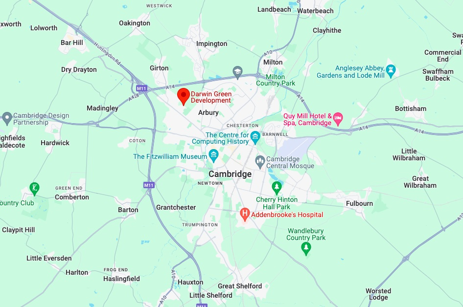



Championing local community, in Cambridge
{.display-6}







{}
Darwin Green is a growing neighbourhood in the north-west of Cambridge with an
active residents’ association
{}

{}
So far, we have been: 
<i class="fa-solid fa-check"></i> Organising local events 
<i class="fa-solid fa-check"></i> Gathering useful information for residents 
<i class="fa-solid fa-check"></i> Collaborating with adjacent areas 
<i class="fa-solid fa-check"></i> Campaigning for better pathways
{}



View our projects



View our events




  <iframe src="https://calendar.google.com/calendar/embed?height=500&wkst=2&ctz=Europe%2FLondon&mode=AGENDA&hl=en_GB&showPrint=0&showTz=0&src=MjFlMTRhN2Y2NDAzNDc4NzEwMGIxOTBiNmQ3M2VjZDg4Mjc1NzJkZDM4NDhiYzBmMWU1MmIxNGIyYzBlNmI2N0Bncm91cC5jYWxlbmRhci5nb29nbGUuY29t&color=%230B8043"
    style="border-width:0; margin-top: 4ex;"
    width="1200"
    height="500"
    frameborder="0"
    scrolling="no"></iframe>


