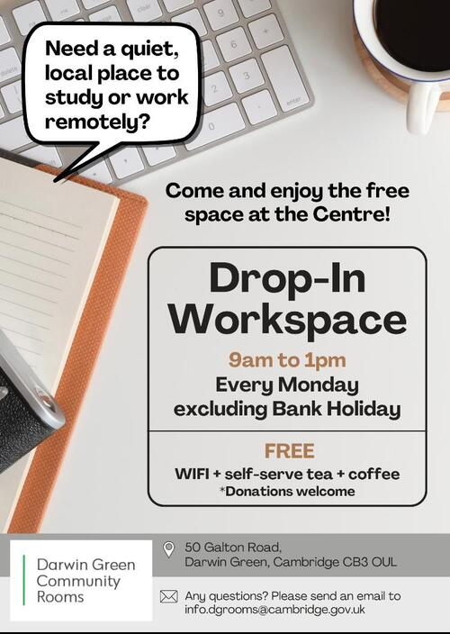

{}
Come to the Community Rooms to work and meet your neighbours
{}

{}
**[Edited 2025-09-11]** Opening time and access conditions have changed, see
[the relevant page](/docs/practical/workspace/) for details.
{}

The Community Rooms are now open as a weekly drop-in workspace for anyone
willing to work in a quiet environment. Just drop-in, get a seat and a table,
connect to the WiFi network, and enjoy a cup of tea or coffee, all for free
(donations are welcome).

The workspace in the Community Rooms will be open once a week. At the moment,
it's **every Monday morning from 9 am to 1 pm**, excluding bank holidays. The
organisers mentioned that days and times might change in the future, depending
on people's feedback.

If you more questions, send them to <info.dgrooms@cambridge.gov.uk>.

The first session took place today, and I counted five residents in the room.
Can we do better next time? Come to work with us, and say hi!

