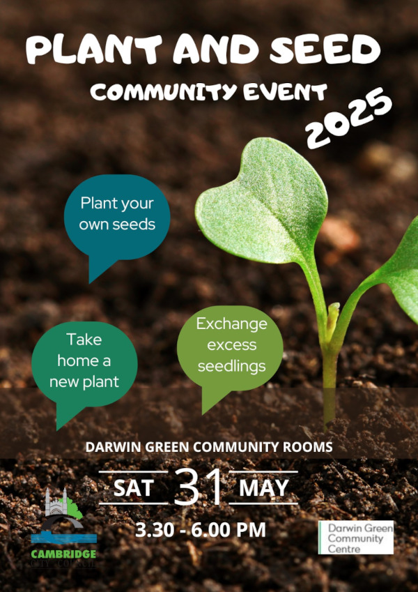

Following a successful first edition in 2024, Darwin Green's Plant & Seed
Exchange comes back this year to give you a new opportunity to swap plants.

The event will take place **on Saturday 31st May**, **from 3:30 to 6:00 pm**,
**in Darwin Green Community Rooms**.

Come to plant your own seeds, take home a new plant, or exchange excess
seedlings. This is also an excellent occasion to share gardening knowledge, or
simply to meet and chat with new neighbours.

But that's not all: this year, you may also decide to buy yourself a treat!
**The Scoops Dessert Truck will be on the Plaza** during the event, so why not
enjoy some ice cream during the afternoon?

Many thanks to Farah for organising the event. Come and meet her at 2025
edition of Darwin Green's Plant & Seed Exchange community event!
