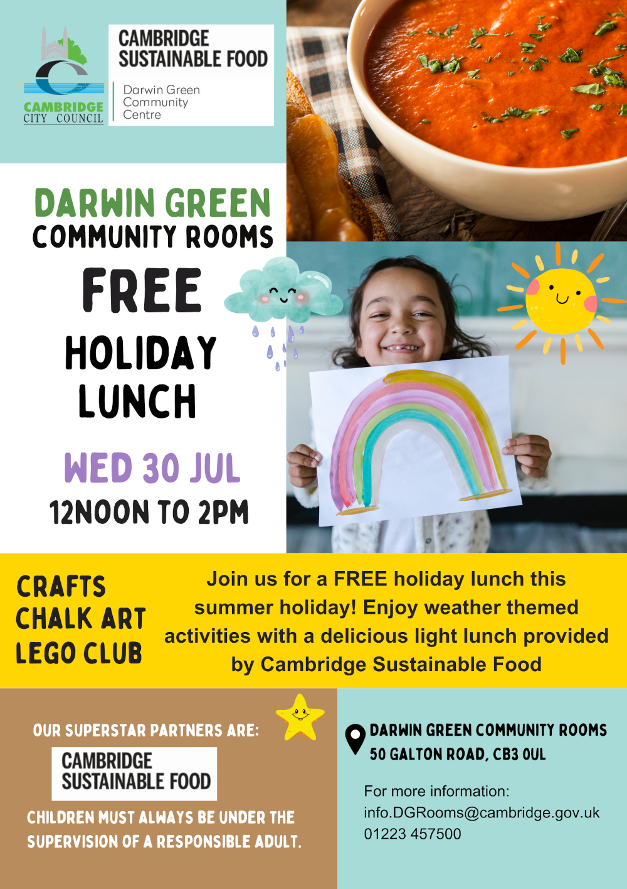

Children are invited for a free holiday lunch, provided by [Cambridge
Sustainable Food] and organised by the Council, at the Darwin Green Community
Rooms on **Wednesday 30th July 2025, from 12 pm to 2 pm**.

They will also be able to enjoy activities such as crafts, chalk arts, Lego
play, and more. This is also a good opportunity for them to meet other children
from the neighbourhood.

Please keep in mind that all children attending must always be under the
supervision of a responsible adult.

For more information, contact <mailto:info.DGRooms@cambridge.gov.uk>, or by
phone: [01223 457500](tel:+441223457500).

[Cambridge Sustainable Food]: https://cambridgesustainablefood.org/
