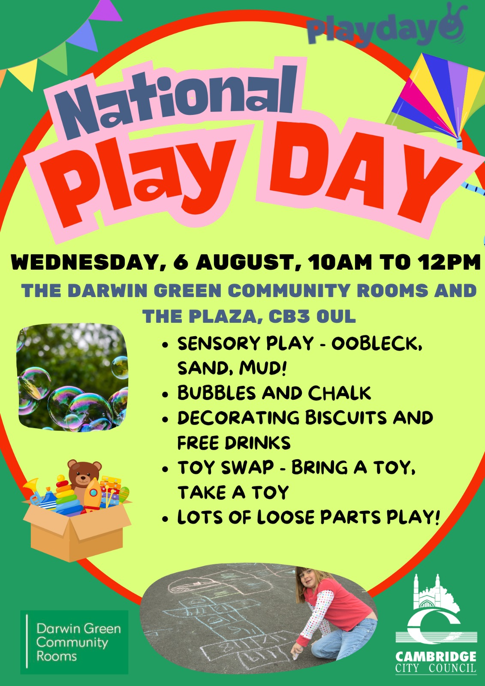

Children are invited to a play session for National Play Day at the Darwin
Green Community Rooms on **Wednesday 6th August 2025, from 10 am to 12 pm**,
organised by Cambridge City Council.

This will include sensory play, bubbles, chalk, decorating biscuits, and many
other loose parts play. There will be free drinks for children.

The event will also include a toy swap, where children can bring a toy to give
away, and take another toy in exchange.

Please keep in mind that all children attending must always be under the
supervision of a responsible adult.

Many thanks to the Council's Community Development team!
