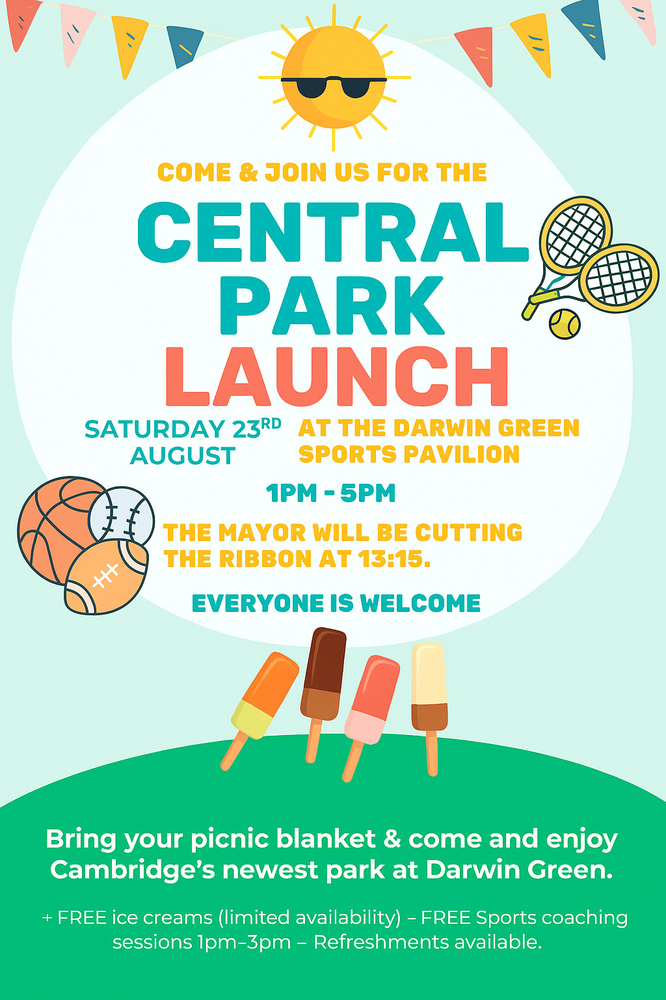

**[Edited 2025-08-28]** The Central Park is now open, see [the article from the
Cambridge Independent][camb-inde] for coverage of the opening.

---

At the heart of the Darwin Green development, the Central Park is a space that
residents have long been waiting to explore. At last, it will officially open
on **Saturday, 23rd August 2025**, and we're celebrating with a launch event!
Come and join us to explore Cambridge's newest park. Everyone is welcome!

## Where and when?

The Central Park launch event will take place on **Saturday, 23rd August from 1
pm to 5 pm** in Darwin Green, Cambridge, in the Central Park area, next to the
sports pavilion.

## What will open?

The tennis courts, football and cricket pitches will open. The north-east
"park" area with the trees and the pond will be open, too.

The sports pavilion will not open just yet, although its restrooms will be
accessible during the launch event.

## What will happen?

Bring your picnic blanket and enjoy the park with friends, family, and
neighbours. Highlights include:

- Ribbon cutting by the Mayor **at 1:15 pm**
- Free ice cream (although with limited availability) from [Scoops of
  Cambridge] dessert truck, offered by the developer (Barratt Redrow)
- Refreshments and food for purchase. [Manna Seoul]'s foodtruck is expected,
  and possibly others
- Sports coaching sessions **from 1 pm to 3 pm**, including football and
  tennis
- A live music band, [Soul Front], will perform
- A free bouncy castle will be available for children
- Free face painting
- Other stalls (commercial or community) may be present, but are still to be
  confirmed.

Come along to explore and celebrate the opening of Darwin Green's Central Park!

[camb-inde]: https://www.cambridgeindependent.co.uk/news/15-acre-central-park-at-darwin-green-development-officially-9431392/
[Scoops of Cambridge]: https://sites.google.com/view/scoopsofcambridge
[Manna Seoul]: https://mannaseoulcambridge.co.uk/
[Soul Front]: https://www.bandsforhire.net/acoustic-music/item/47-soul-front
