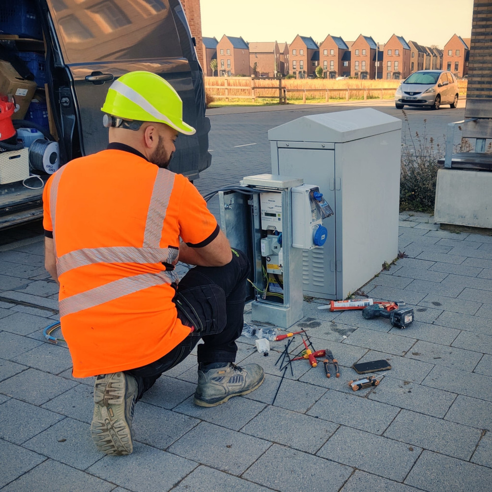
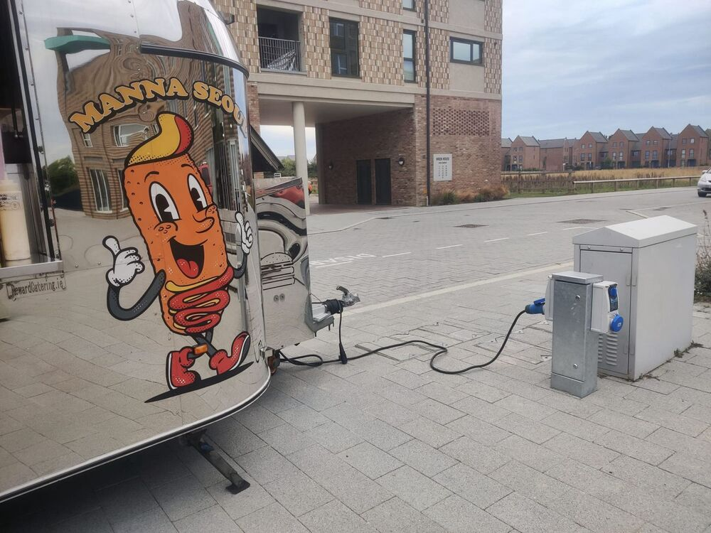
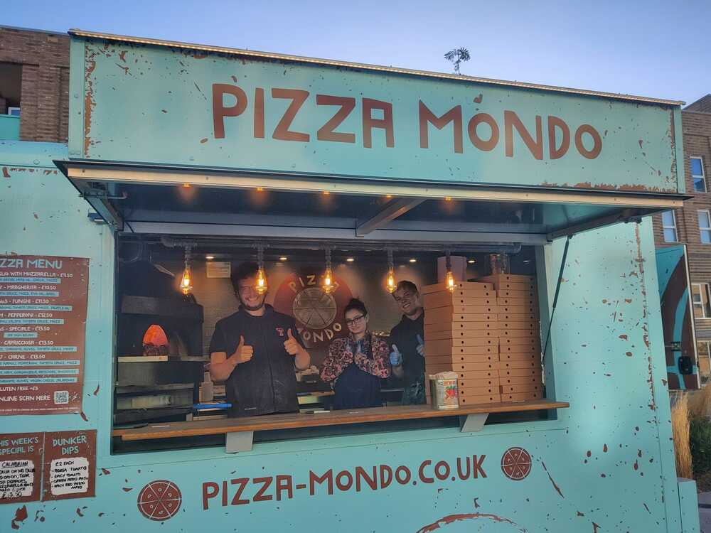
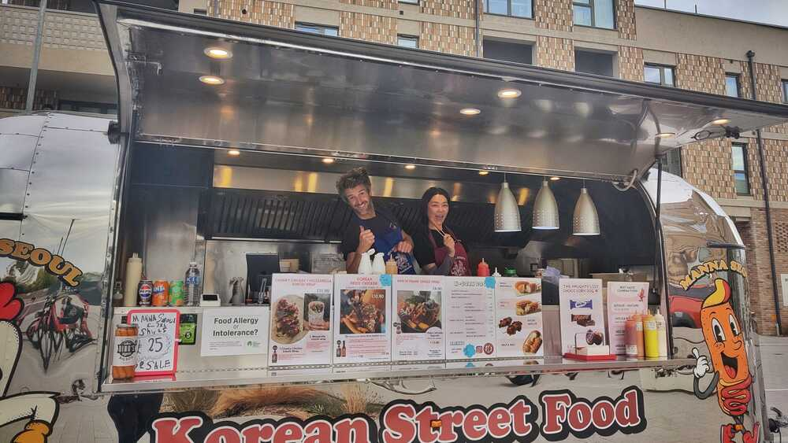
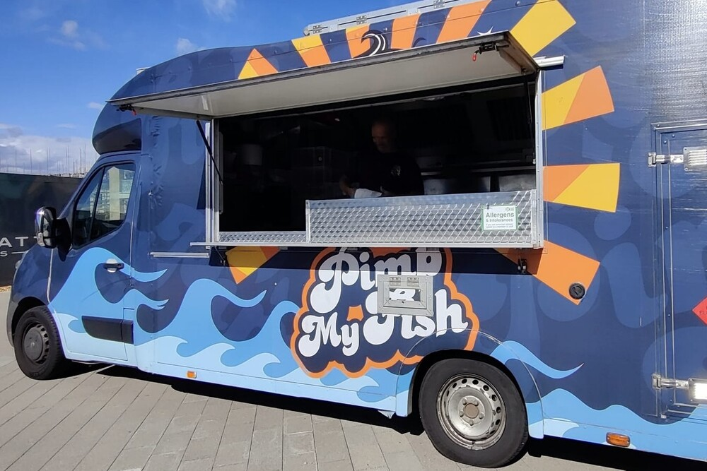
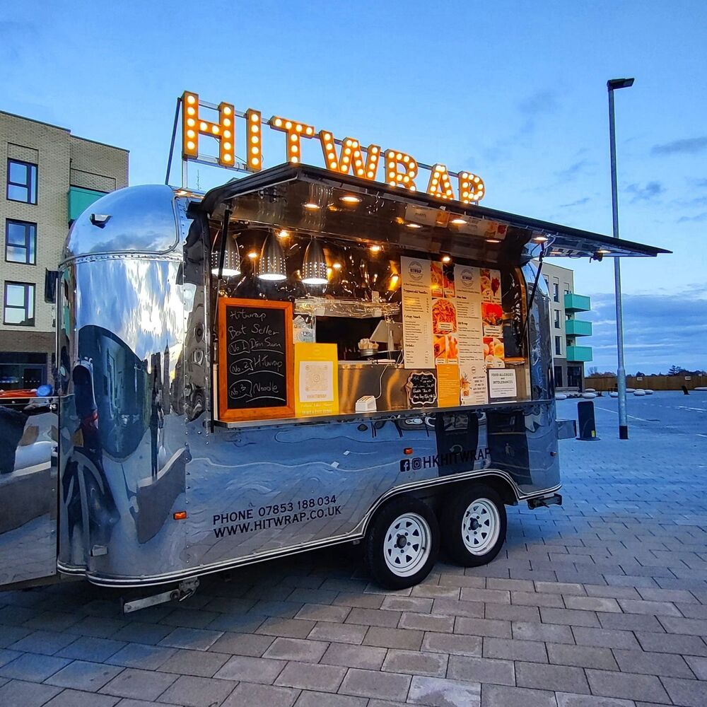
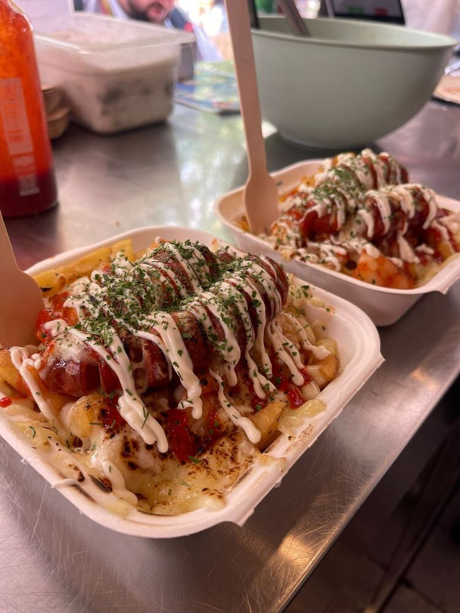
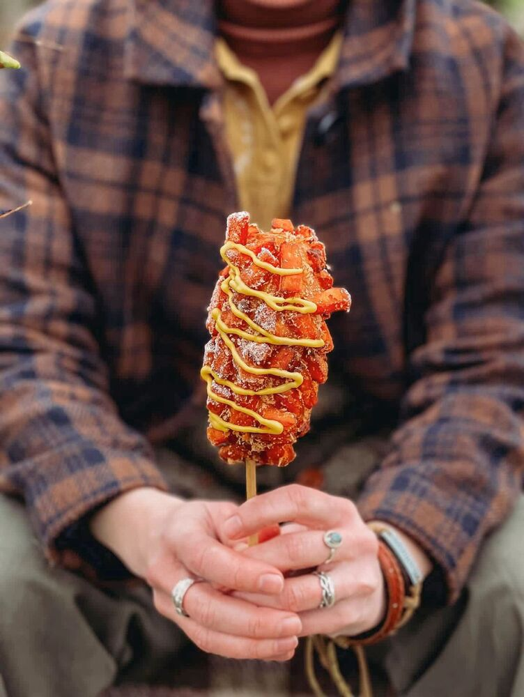
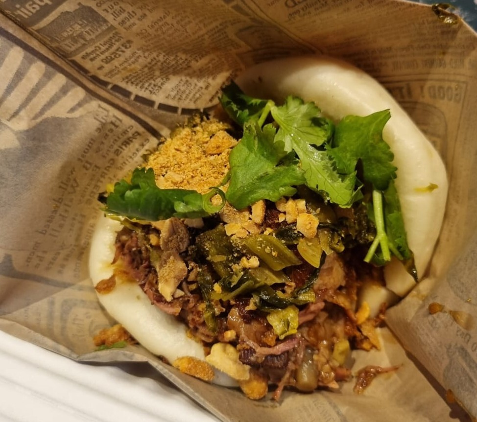

Good news from Darwin Green Plaza: the community power socket has been
installed, and it is already making a difference as the food truck lineup
continues to grow!

## A quieter Plaza: Community power is here

The newly installed community electricity socket on the Plaza is proving its
worth. Food trucks visiting Darwin Green can now plug in directly, eliminating
the need for noisy generators. The result? A more pleasant atmosphere for
everyone enjoying their meal on the Plaza. By connecting to the mains power,
the trucks can operate silently while serving their gourmet food.


  
    
  
  
    
  


## A busier Plaza: More food trucks, more often

The food truck schedule at Darwin Green Plaza has expanded significantly.


  
    
  
  
    
  



  
    
  
  
    
  


At the moment, all food trucks come on Thursdays, one at a time. Here's who you
can expect to see:

* **[Pizza Mondo]** brings fresh pizzas
* **[Manna Seoul]** serves up Korean corn-dogs and fried chicken
* **[Pimp My Fish]** offers fish & chips, tacos, burgers, and more
* **[HitWrap]** has a selection of wraps and noodles


  
    
  
  
    
  
  
    
  


More may join in the future. Check the [calendar on the front page](/)
or the [recurring events page](/docs/practical/events/) to see who's coming
next. You're sure to find something to your taste!

[Manna Seoul]: https://mannaseoulcambridge.co.uk/
[Pizza Mondo]: https://order.pizza-mondo.co.uk/
[Pimp My Fish]: https://www.pimp-my-fish.co.uk/
[HitWrap]: https://order.storekit.com/hitwrap-stevenage/

## An exciting Plaza: Grabbing power

Community power has been a request from Darwin Green residents for a while. At
last, the installation took place late in September, and food trucks were quick
to take advantage. But this is also an opportunity for more to come to the
Plaza. We've been hearing rumours about a Christmas tree coming for the end of
the year. Lighting the Plaza during winter would be such a nice thing!

_Many thanks to Darwin Green's residents and the local Councillors who pushed
to have community power installed, and to Barratt Redrow who delivered._

_Thanks to George for all the photos in this post._
