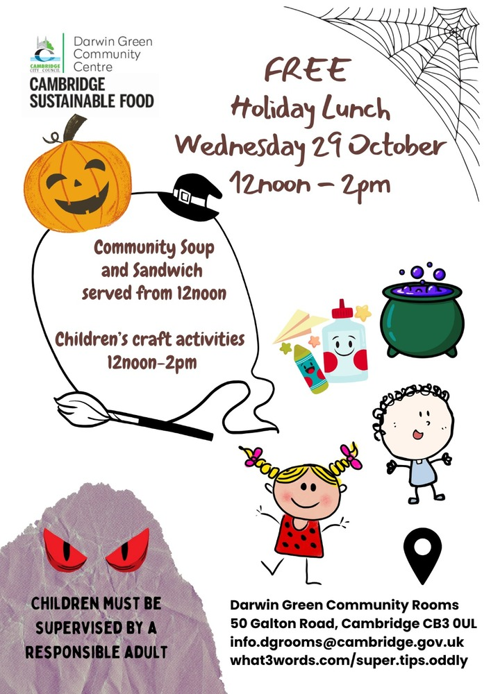

Children are invited for a free holiday lunch, provided by [Cambridge
Sustainable Food] and organised by the Council, at the Darwin Green Community
Rooms on **Wednesday 29th October 2025, from 12 pm to 2 pm**.

At the menu: "community soup" and sandwiches will be served at noon. After
lucnch, prepare yourselves for Halloween! Children will be able to enjoy crafts
until 2 pm. This is a good opportunity for them to meet other children from the
neighbourhood and enjoy some Halloween-themed fun.

Please keep in mind that all children attending must always be under the
supervision of a responsible adult.

For more information, contact <info.dgrooms@cambridge.gov.uk>, or by phone:
[01223 457500](tel:+441223457500).

[Cambridge Sustainable Food]: https://cambridgesustainablefood.org/
