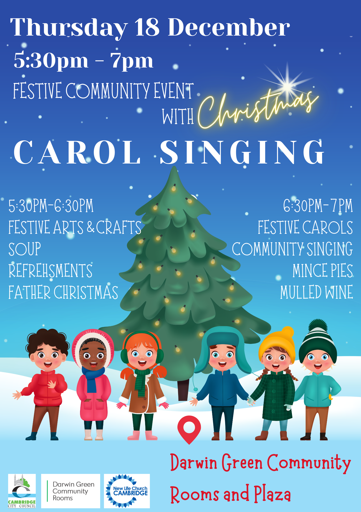

There will be a festive community evening at the Darwin Green Community Rooms
and Plaza on **Thursday 18th December 2025, from 5:30 pm to 7 pm**, organised
by Cambridge City Council.

The evening will be split into two parts:

- **From 5:30 to 6:30 pm** we'll have festive arts and crafts for children.
  Warm soup and refreshments will be served, and who knows, Father Christmas
  might make an appearance!

- **From 6:30 to 7 pm**, members of the [New Life
  Church](https://www.newlifechurchcambridge.org/) community will perform carol
  singing[^1]. Mince pies and (alcohol-free) mulled wine will be served.

Food trucks will be on the Plaza during the event: **[Pimp My
Fish](https://pimp-my-fish.co.uk/) and its fish & chips** will attend, as well
as the **[Churros Bar](https://churrosbar.co.uk/)**, serving---you guessed
it---**churros**.

This is a great opportunity to come together and celebrate, and meet people
from the neighbourhood. Everyone is welcome to join. We're looking forward to
seeing you on the 18th!

[^1]: Note: Apart from the lyrics from the Christmas carols, which
    traditionally relate to the Nativity, the community event in Darwin Green
    on 18th December is not a religious event.
