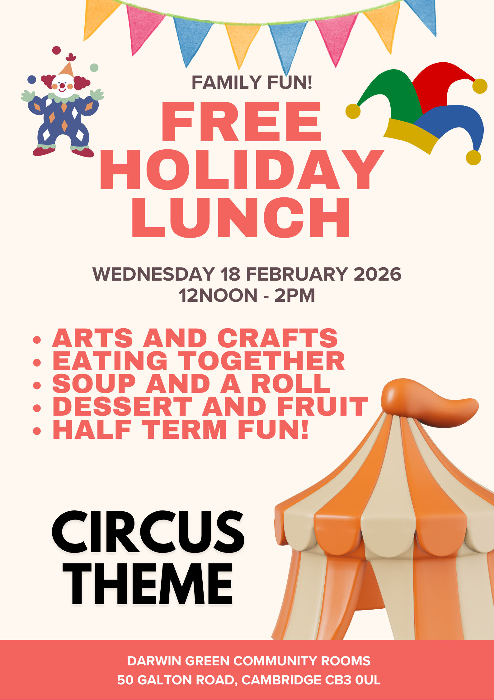

Children are invited for a free holiday lunch, provided by [Cambridge
Sustainable Food] and organised by the Council, at the Darwin Green Community
Rooms on **Wednesday 18th February 2026, from 12 pm to 2 pm**.

This half-term edition has a circus theme! Children will enjoy soup and a roll,
followed by dessert and fruit. After lunch, they will be able to take part in
arts and crafts activities. This is a good opportunity for them to meet other
children from the neighbourhood and enjoy some half-term fun together.

Please keep in mind that all children attending must always be under the
supervision of a responsible adult.

For more information, contact <info.dgrooms@cambridge.gov.uk>, or by phone:
[01223 457500](tel:+441223457500).

[Cambridge Sustainable Food]: https://cambridgesustainablefood.org/
