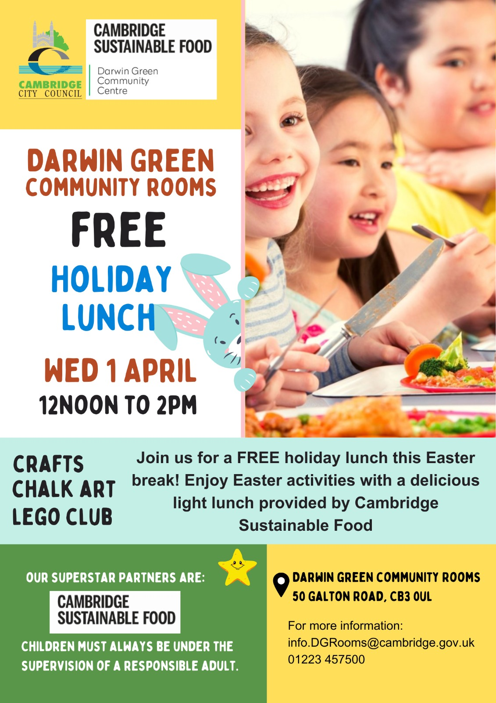

Children are invited for a free holiday lunch, provided by [Cambridge
Sustainable Food] and organised by the Council, at the Darwin Green Community
Rooms on **Wednesday 1st April 2026, from 12 pm to 2 pm**.

This Easter edition will feature a light lunch, followed by Easter activities
including crafts, chalk art, and Lego club. This is a good opportunity for
children to meet others from the neighbourhood and enjoy some Easter holiday
fun together.

Please keep in mind that all children attending must always be under the
supervision of a responsible adult.

For more information, contact <info.DGRooms@cambridge.gov.uk>, or by phone:
[01223 457500](tel:+441223457500).

[Cambridge Sustainable Food]: https://cambridgesustainablefood.org/
