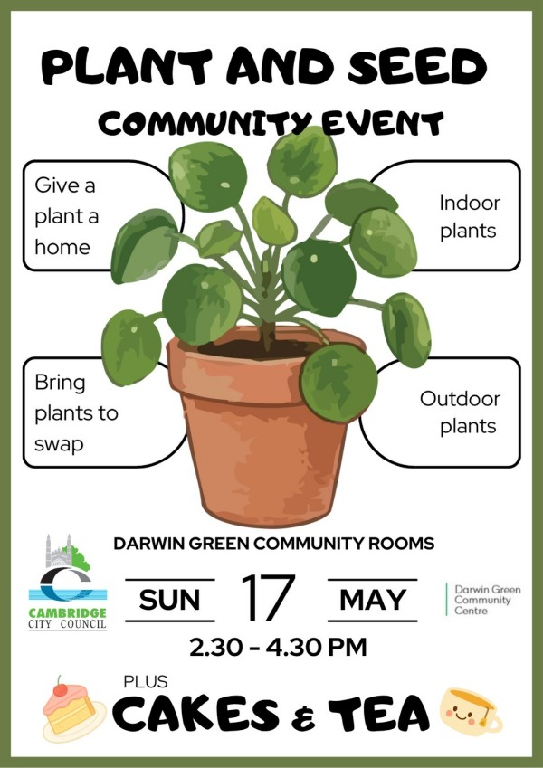

Darwin Green's Plant & Seed Exchange community event is back again this year
for a third edition, to give you an opportunity to swap plants with your
neighbours.

The event will take place **on Sunday 17th May**, **from 2:30 to 4:30 pm**,
**in Darwin Green Community Rooms**.

Come along and find a free plant for your home or garden. Bring along any
plants, cuttings, seedlings or seeds you have to share. Don't worry if you have
nothing to swap, you're very welcome to find a plant with us anyway! There'll
be simple planting activities for families, plus tea and sweet treats to enjoy.
Come and join us!
