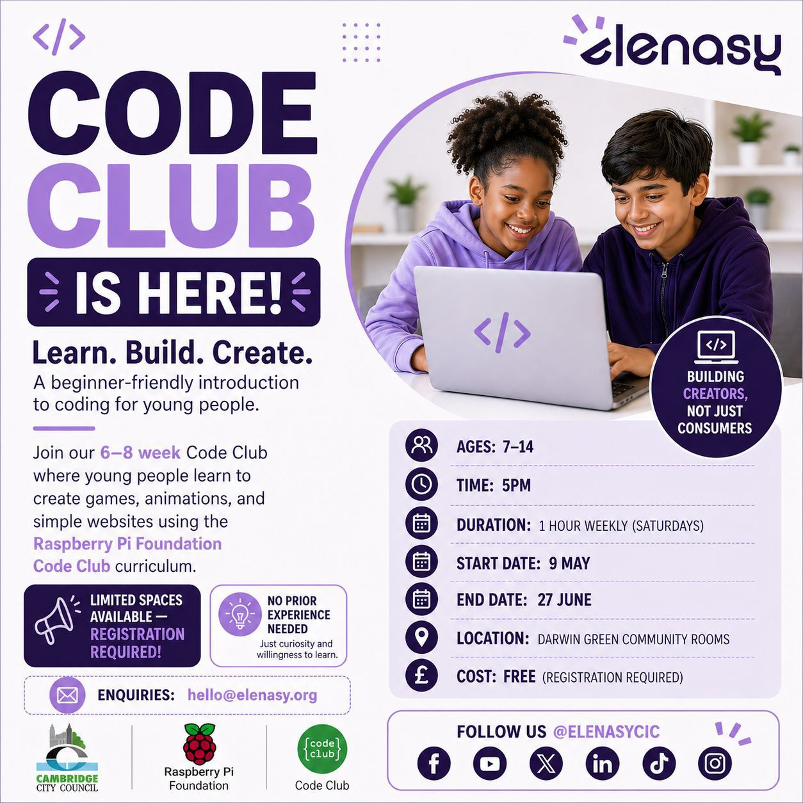

Darwin Green continues to see a growing range of activities supporting
children, young people, and families in the community, particularly around
digital well-being and safer internet use. Building on this, a new **Code Club**
is launching locally, offering young people the opportunity to explore the
creative side of technology.

Delivered by [Elenasy CIC][elenasy] and based on the [Raspberry Pi Foundation's
Code Club][rpfcc] curriculum, the sessions will introduce children aged 7-14
to coding through simple, hands-on projects such as games and animations.

The programme reflects a broader shift from not just encouraging safer use of
technology, but also helping young people understand how it works -- giving
them the confidence to engage more thoughtfully and creatively in a digital
world.

The sessions will run at the Darwin Green Community Rooms and are designed to
be beginner-friendly and accessible to those with little or no prior
experience. This is part of a wider effort, supported by local partners
including Cambridge City Council, to provide meaningful, community-based
opportunities for young people.

## Practical details

- **Ages:** 7-14; no prior experience needed
- **Dates:** Saturdays, from 9 May to 27 June 2026
- **Time:** 5:00 pm (1 hour weekly)
- **Location:** Darwin Green Community Rooms (50 Galton Road, CB3 0UL)

Attendance is free, but registration is required. To sign up, please complete
the [registration form][form].

The club is limited to 15 spaces. Devices will be available for some; others
may bring their own.

For any enquiries, contact Elenasy CIC at <hello@elenasy.org>.

[elenasy]: https://elenasy.org
[rpfcc]: https://codeclub.org/
[form]: https://docs.google.com/forms/d/e/1FAIpQLSeKZzH42U9lXnkpJj-LNA7SVFdUgwhvRGlD-0-KlJiUr3cIxg/viewform
