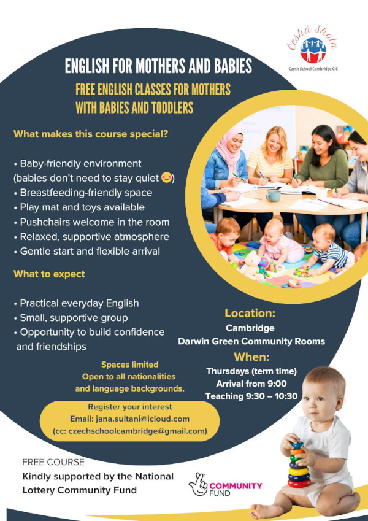

A new **free English course for mothers with babies and toddlers** is starting
at the Darwin Green Community Rooms. Organised by [Czech School Cambridge
CIC][csc] and kindly supported by the [National Lottery Community
Fund][lottery], the sessions are designed to be relaxed, welcoming, and built
around young children.

The course is open to all nationalities and language backgrounds, so do pass
the word to any neighbour who might benefit, whether they want to learn and
practise everyday English, build some confidence with a small and supportive
group, or simply meet other parents to build new friendships.

Bring in the little ones! Sessions feature:

- Baby-friendly environment (babies don't need to stay quiet!)
- Breastfeeding-friendly space
- Play mat and toys available
- Pushchairs welcome in the room
- Relaxed, supportive atmosphere
- Gentle start and flexible arrival

## Practical details

- **Day:** Thursdays, during term time, from 21 May 2026 to January 2027
- **Time:** arrival from 9:00 am, teaching from 9:30 to 10:30 am
- **Location:** Darwin Green Community Rooms (50 Galton Road, CB3 0UL)
- **Free attendance**

Spaces are limited. To register your interest, please email Jana Sultani at
[jana.sultani@icloud.com](mailto:jana.sultani@icloud.com?cc=czechschoolcambridge@gmail.com).

[csc]: https://czechschoolcambridge.com/
[lottery]: https://www.tnlcommunityfund.org.uk/
