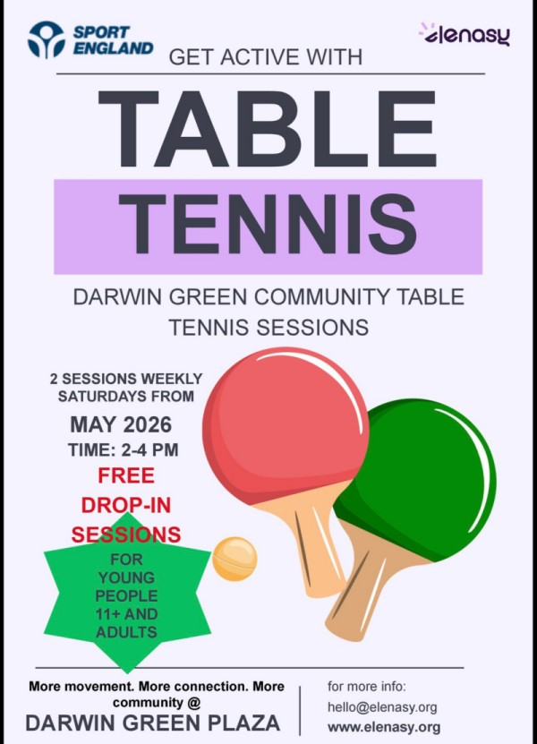

Darwin Green has a new community activity, and it's already up and running!

{}
Residents trying out the tables at the launch session on 30 May.
{}

[Elenasy CIC][elenasy], supported by [Sport England] funding, launched free
drop-in table tennis sessions at Darwin Green Plaza on Saturday 30 May with a
taster session that got the community moving. The response was great, and
we're now inviting more residents to come and join in.

Sessions run **every Saturday from 2 to 4 pm**, in front of the Community
Rooms, and they're open to everyone, adults and young people aged 11 and over.
No experience needed, no kit required, just turn up!

The sessions are part of a 40-week programme designed to give Darwin Green
residents a regular, free and fun way to get moving. Table tennis is one of
those rare activities that works for almost anyone. It's easy to pick up,
gentle on the body, and genuinely enjoyable from the very first rally. For
anyone who has been less active lately, it's a low-pressure way back into
regular movement without it feeling like exercise.

But it's not just about physical activity. Regular sessions like these give
neighbours a reason to meet, chat and spend time together, something that can
be harder to find in a new and growing community like Darwin Green.

[As previously announced][previous-table-tennis], the programme has also
secured funding for a permanent outdoor table tennis table to be installed in
the local area, meaning the legacy of this project will outlast the sessions
themselves. Once in place, it will be there for residents to use freely, at any
time.

For more information, visit [elenasy.org][elenasy] or email
<hello@elenasy.org>.

[elenasy]: https://elenasy.org
[Sport England]: https://www.sportengland.org/
[previous-table-tennis]: 
