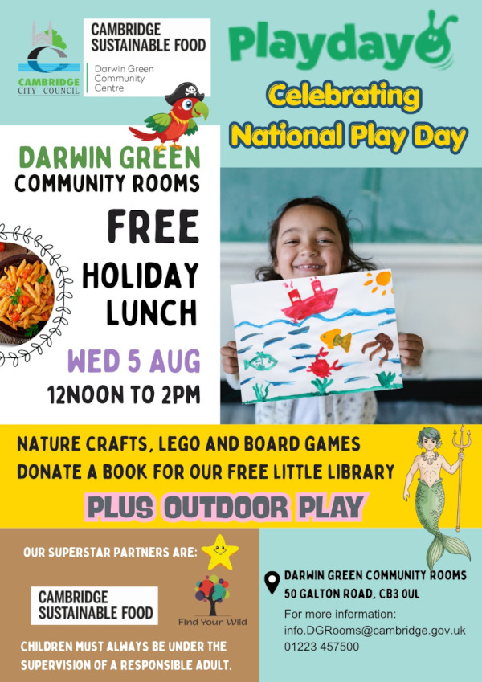

Children are invited to celebrate National Play Day with a free holiday lunch
at the Darwin Green Community Rooms on **Wednesday 5 August 2026, from 12 pm to
2 pm**, organised by Cambridge City Council and [Cambridge Sustainable Food].

The session will include nature crafts organised by [Find Your Wild], Lego, and
board games, plus outdoor play including table tennis. Children are also
welcome to bring a book to donate to the Community Rooms' free little library.

Please keep in mind that all children attending must always be under the
supervision of a responsible adult.

For more information, contact <info.DGRooms@cambridge.gov.uk>, or by phone:
[01223 457500](tel:+441223457500).

[Find Your Wild]: http://www.findyourwild.org/
[Cambridge Sustainable Food]: https://cambridgesustainablefood.org/
