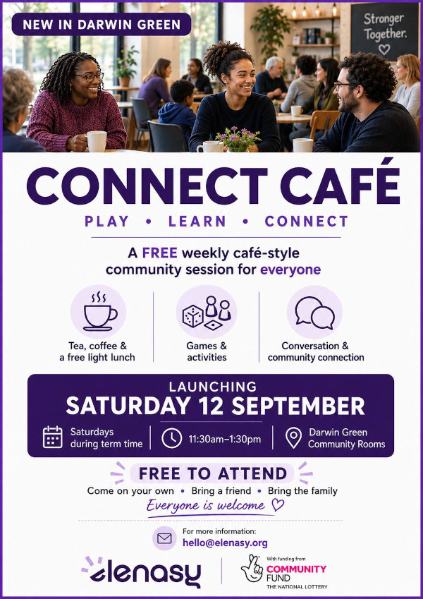

What if Saturday lunchtime became an opportunity to meet other families, share
a meal, make new friends and feel a little more connected to the community
around us?

This September, [Elenasy CIC][elenasy] is launching **Connect Café**, a free
weekly Saturday lunch club creating a welcoming space for families in Darwin
Green to eat, play, talk and spend time together.

Held at the Darwin Green Community Rooms, the café-style sessions will give
parents, carers and children the opportunity to enjoy a free hot lunch, meet
other local families, and take part in games and family activities that
encourage teamwork, creativity and quality time together. There will also be
relaxed conversations around topics that are useful and relevant to everyday
family life, including online safety and digital wellbeing, parenting, local
enterprise and small business, local opportunities, and community life. It will
be a chance to exchange ideas, discover what's happening locally and make
connections with people who live around us.

Connect Café is designed as a shared family experience rather than a drop-off
children's activity. Whether you're new to Darwin Green, work from home, care
for children, run a small business locally, or have lived here for years and
simply want to know more people in the community, you're welcome to come along.

## Practical details

The Connect Café launches on **Saturday 12 September 2026**.

- **Time:** Saturdays during term time, from 11:30 am to 1:30 pm
- **Location:** Darwin Green Community Rooms
- **Free attendance** -- come on your own, bring a friend, or bring the family

Connect Café has been made possible with funding from [the National Lottery
Community Fund][lottery].

For more information, contact Elenasy CIC at <hello@elenasy.org>.

We look forward to opening the doors in September, we hope you'll join us!

[elenasy]: https://elenasy.org
[lottery]: https://www.tnlcommunityfund.org.uk/
